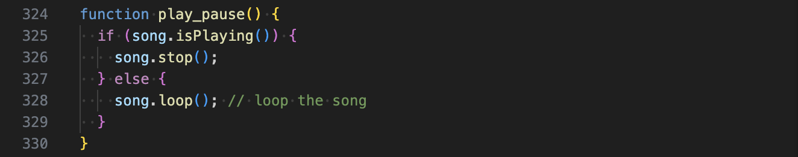

# swan0267_9103_Tut2_GroupA

# Dancing to Boogie Woogie
## Instructions

Click the button on the bottom left corner of the yellow TV background in second floor. Then the animation will start immediately.

## Details of Animating the Group Code
### Inspirations & References
1. De Stijl

   
   Mondrian was one of the founders of De Stijl, an art movement known for its use of geometric shapes, straight lines, and primary colours (red, yellow, and blue) to achieve an aesthetic of abstraction and minimalism (Tate, n.d.). This style not only used in painting, but also in other field like architecture, furniture design, graphic design. Therefore, all objects in the level 2 are designed in this style.

2. *Broadway Boogie Woogie*

   
   This is a painting created by Mondrian in 1942-1943. The“Boogie Woogie”in it’s title, is a popular jazz style known for its fast tempo and upbeat rhythm (Museum of Modern Art, n.d.). In this painting, Mondrian densely arranges small coloured blocks and places them asymmetrically, visually conveying the energy of Boogie Woogie music. Therefore, when I animating this work, I aimed to reflect the same energy as Boogie Woogie.

### Animation Driven Method (Audio)
Based on these two inspirations and my plan for the final effect, I chose to use audio to animate the artwork. For the audio track, I selected Boogie Woogie music to correspond to the artwork’s theme.

### Animation Effect Details
In level 2, objects like the circles on the TV screen, the cat, and the plant leaves all follow the audio level content of Boogie Woogie music. Creating a lively visual effect that all objects seem to enjoy and dance along with the music.

### Technical Explanation

Use function preload() to load the music, p5.Amplitude() to analyse volume, and analyzer.setInput() to connect the music.

Create a button, and use style to modify the button’s position, size, radius, font size, padding, and colour. Apply button.mousePressed(play_pause) to run the function play_pause. 

Use let rms = analyzer.getLevel() to get the real-time amplitude value of the music. Newly drawn elements like the cat’s body and legs, plant leaves, and TV. Add rsm in their Parameter to let them respond to the audio’s volume, dynamically interacting with the music.

Use the play_pause() function to control music.

## Reference

Huszár, V. (1917). *De Stijl.*  Museum of Modern Art.
https://www.moma.org/collection/works/7893

Mondrian, P. (1942). *Broadway boogie woogie* [Painting]. Museum of Modern Art.
https://www.moma.org/collection/works/78682

Tate. (n.d.). *De Stijl.* Tate Glossary.
https://web.archive.org/web/20170211033009/http://www.tate.org.uk/learn/online-resources/glossary/d/de-stijl